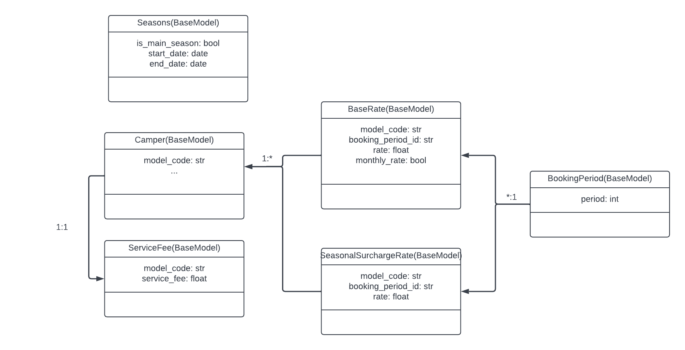

[](https://github.com/psf/black)
[](https://pycqa.github.io/isort/)

# Lucidchart2SqlAlchemy
- when creating UML charts in Lucidchart I needed to create these objects "twice" with
this package you're being able to generate python-files including SqlAlchemy-Models


- will generate models like this
```python
class BaseRate(BaseModel):
    __tablename__ = "base_rate"

    model_code: str = sa.Column(sa.String)
    booking_period_id: str = sa.Column(sa.String, sa.ForeignKey("booking_period.id"))
    rate: float = sa.Column(sa.Float)
    monthly_rate: bool = sa.Column(sa.Boolean)
```